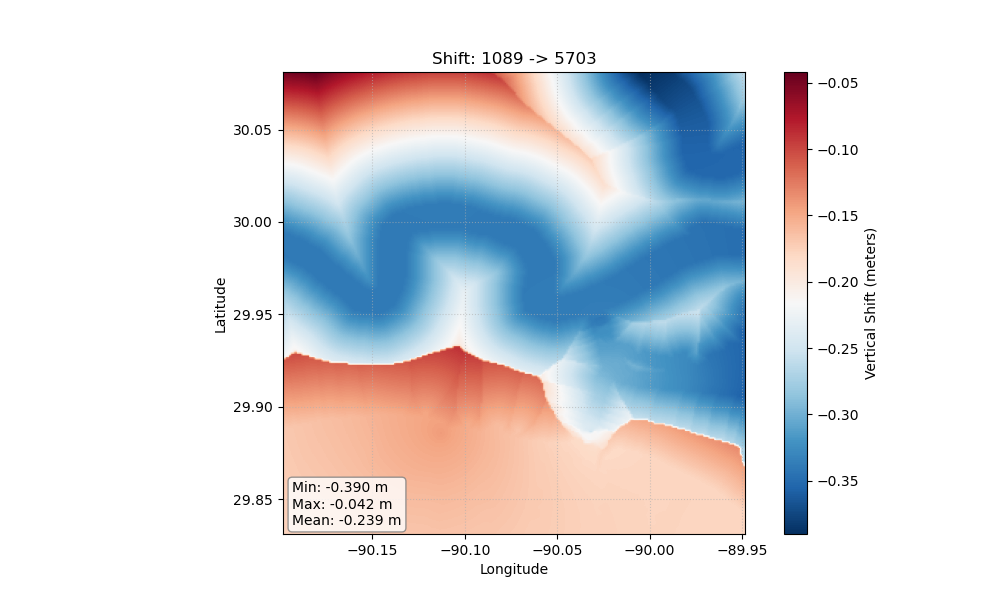

# 🌍 Transformez ↕

**Vertical datum transformations, simplified.**

> ⚠️ **BETA STATUS:** This project is in active development (v0.1.0).

Transformez is a standalone Python library and CLI for converting geospatial data between vertical datums (e.g., MLLW to NAVD88).

## Why Transformez?

Vertical datum transformation is often the hardest part of coastal DEM generation. Existing tools are either massive, complex desktop software or buried deep within heavy GIS libraries that are difficult to automate in a headless Linux environment.

**Transformez solves this by being:**
* **Lightweight:** A pure Python package that does one thing well. It doesn't require a GUI or a 5GB installer.
* **Grid-Based:** It uses the official VDatum GTIF/GTX grids directly, ensuring your transformations match authoritative standards. 
* **Developer Friendly:** It offers a clean Python API for integrating vertical shifts directly into your numpy/rasterio pipelines, plus a CLI for quick batch processing.

It works in two ways:
1.  **Standalone CLI:** Generate shift grids (TIF) for any region or match an existing DEM.
2.  **Fetchez Plugin:** Automatically transform data as it is downloaded.


*(Above: A generated vertical shift grid transforming MLLW to NAVD88)*

## Features

* **Tidal Transformations:** Wraps NOAA's **VDatum** to transform between tidal surfaces (MLLW, MHHW) and geometric datums.
* **Geoid Grids:** Seamlessly applies PROJ-CDN geoids (GEOID18, GEOID12B, EGM2008).
* **Time-Dependent Shifts:** Integrates **HTDP** to handle crustal velocities and epoch transformations.
* **Grid Engine:** Automates the fetching, stitching, and mosaicking of partial VDatum grids into a single continuous shift surface.

---

## Installation

* Requires **Fetchez** (v0.3.3+) and standard geospatial libs.

* **HTDP / VDatum**: See [NOAA Geodesy Tools](https://geodesy.noaa.gov/TOOLS/Htdp/Htdp.shtml).

```bash
# Clone and install
git clone https://github.com/ciresdem/transformez.git
cd transformez
pip install -e .
```

## Usage
1. Standalone CLI
Use transformez to generate shift grids for use in other software (PDAL, GDAL, CARIS) or to transform a specific DEM directly.

* Mode A: Region & Resolution

Generate a generic shift grid for a specific bounding box.

```bash
# Generate a shift grid from MLLW (5866) to NAVD88 (5703)
# -R: West/East/South/North
# -E: Grid resolution (e.g., 3 arc-seconds)
transformez -R -95.5/-94.5/28.5/29.5 -E 3s \
    --vdatum-in "5866" \
    --vdatum-out "5703:g2018" \
    --output mllw_to_navd88.tif
```

* Mode B: Match Input DEM

Automatically extract the bounds and resolution from an input DEM and generate a matching transformed output.

```bash
# Transform an existing DEM from Ellipsoidal (6319) to Orthometric (5703)
transformez --dem input_dem.tif \
    --vdatum-in "6319" \
    --vdatum-out "5703" \
    --output output_navd88.tif
```

2. As a Fetchez Hook
Configure fetchez to generate transformation grids automatically for downloaded data regions.

```bash
# Download SRTM and prepare a shift grid from EGM96 to WGS84
fetchez srtm_plus -R -120/-119/33/34 --hook transformez:datum_in=5773,datum_out=4979
```

## Python API

Transformez can be used directly in Python scripts to generate shift grids or transform arrays.

### 1. Generate a Vertical Shift Grid
Use `VerticalTransform` to calculate the shift array (numpy) between two datums for a specific region.

```python
from transformez.transform import VerticalTransform
from fetchez.spatial import Region
from transformez.grid_engine import GridWriter

# 1. Define the Region (West, East, South, North)
#    and the Grid Dimensions (nx, ny)
region = Region(-95.5, -94.5, 28.5, 29.5)
nx, ny = 1200, 1200 

# 2. Initialize the Transformer
#    - MLLW (5866) -> NAVD88 (5703) via GEOID18
vt = VerticalTransform(
    region=region,
    nx=nx, ny=ny,
    epsg_in="5866",       
    epsg_out="5703:geoid=g2018" 
)

# 3. Generate the Shift Array (numpy)
#    Returns: (shift_grid, uncertainty_grid)
shift_grid, unc = vt._vertical_transform(vt.epsg_in, vt.epsg_out)

# 4. Save to GeoTIFF
GridWriter.write("mllw_to_navd88.tif", shift_grid, region)
```

### 2. Transform an Existing DEM

If you have a DEM and a generated shift grid, you can apply the transformation mathematically using GridEngine.

```python
from transformez.grid_engine import GridEngine

# Apply the vertical shift: Output = Input + Shift
# Matches pixels 1:1, handling NoData and bounds automatically.
GridEngine.apply_vertical_shift(
    src_dem="input_ellipsoidal.tif",
    shift_array=shift_grid,  # numpy array from step above
    dst_dem="output_orthometric.tif"
)
```

### 3. Parse SRS & Datums

You can use the helper classes to resolve complex datum strings or EPSG codes.

```python
from transformez.definitions import Datums

# Get VDatum CLI string for an EPSG
v_str = Datums.get_vdatum_id(5866) 
# Returns: 'mllw:m:height'

# Get Default Geoid for a Datum
geoid = Datums.get_default_geoid(5703)
# Returns: 'g2018'
```

## Supported Datums

Transformez supports EPSG codes and compound formats (EPSG:GEOID).

Ellipsoidal: 6319 (NAD83 2011), 4979 (WGS84)

Orthometric: 5703 (NAVD88), 5702 (NGVD29), 3855 (EGM2008)

Tidal: 5866 (MLLW), 5869 (MHHW), 5714 (MSL)

Geoids: g2018, g2012b, xgeoid20b, egm2008

## License
MIT
