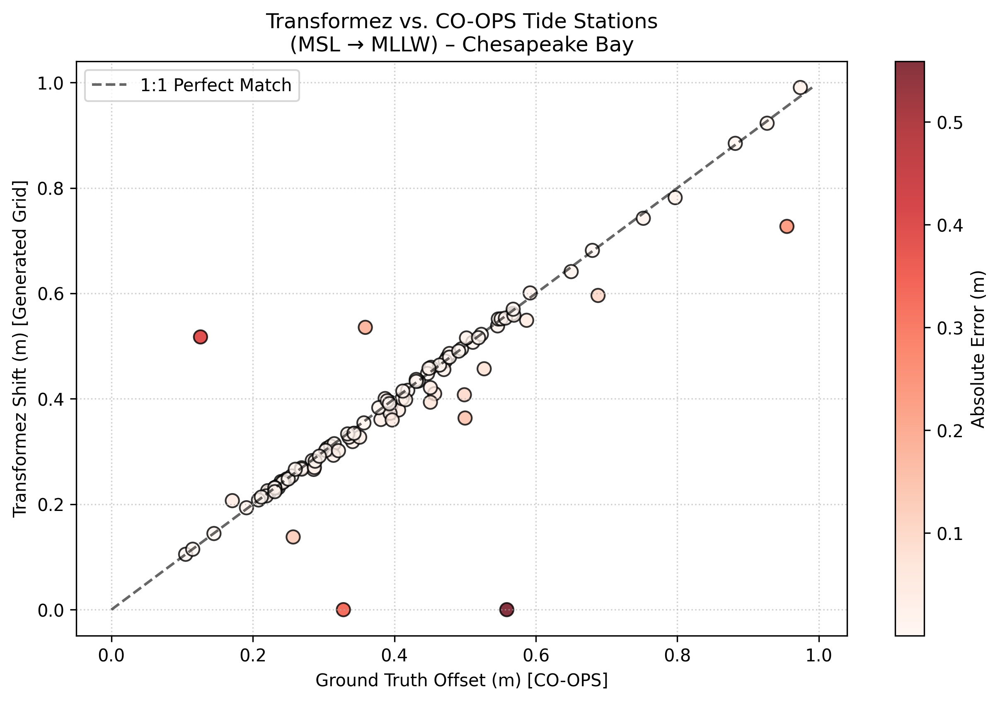
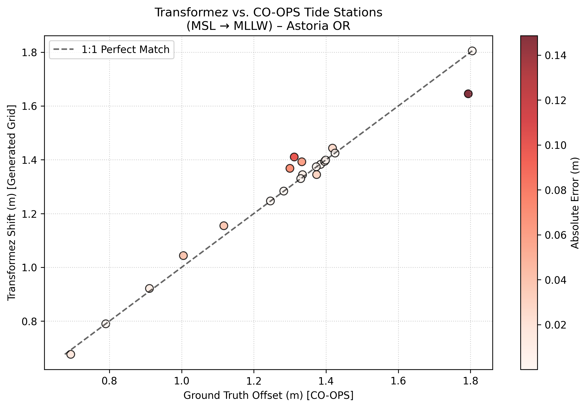
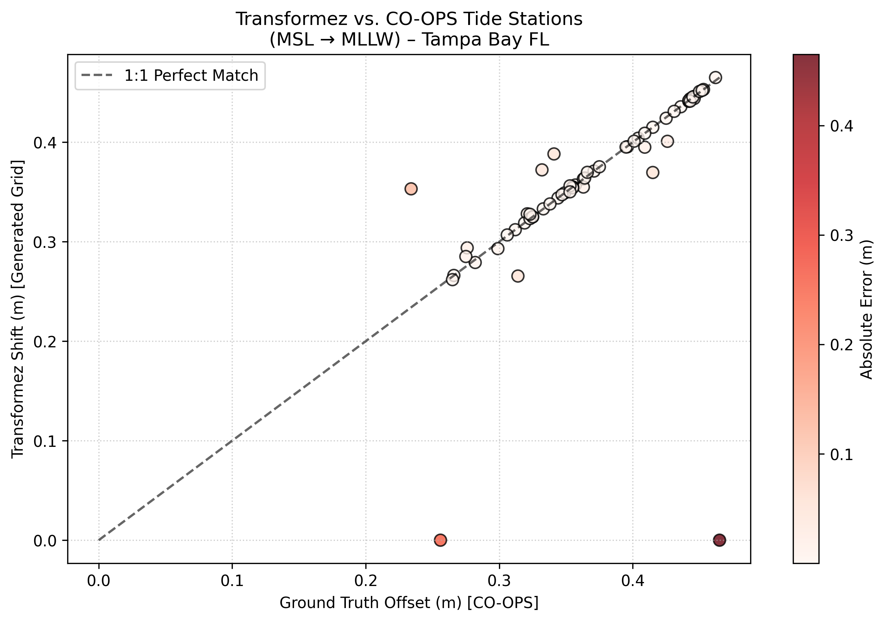
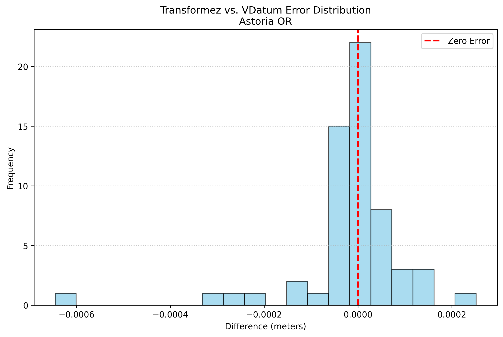
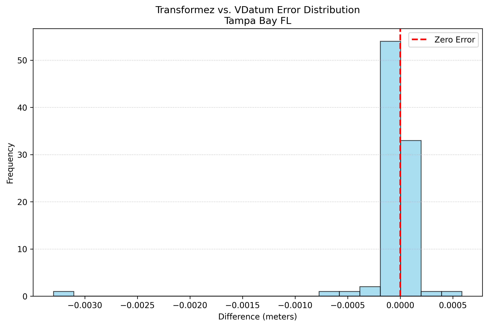
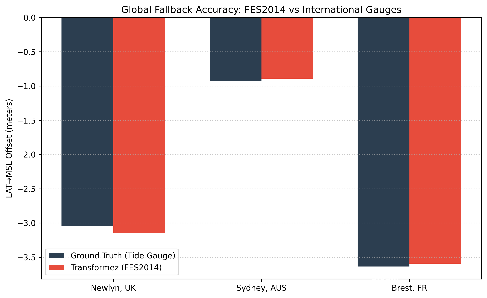

# 🏹 Validation & Accuracy

Transformez is validated at several different levels because no single benchmark can fully describe the behavior of a coastal vertical-datum transformation engine. The tests below separate provider/grid accuracy, production coastal behavior, global-model agreement, and external HTDP integration.

These results should therefore be interpreted according to the purpose of each test rather than as interchangeable measures of a single global accuracy value. In particular, the NOAA CO-OPS station comparison includes Transformez's production shoreline, coverage, and inland-decay policy, while the NOAA VDatum comparison intentionally removes those effects to isolate numerical engine equivalence.

## Test 1: Production Coastal Surface vs. NOAA CO-OPS Tide Stations

This test generates a 3 arc-second MSL → MLLW shift grid using the normal Transformez coastal policy and samples it at NOAA CO-OPS tide-station locations. The comparison therefore evaluates the complete production surface, not only the underlying VDatum transformation mathematics.

The validation uses a 250 m full-strength coastal buffer followed by a 5.0 km inland decay. Valid VDatum coverage, the Dist2Coast-derived effective water domain, raster sampling, shoreline geometry, and coastal fallback behavior can all influence individual station comparisons.

CO-OPS stations are point observations intentionally located in the tidal environment, whereas Transformez produces a continuous raster intended for DEM transformation. A gauge may sit on a pier, seawall, narrow creek, harbor edge, or mixed land/water raster cell. For that reason, RMSE in this test should be interpreted as an operational coastal-surface metric rather than a direct estimate of the numerical error of the datum engine itself.

Small mean bias together with larger RMSE generally indicates local spatial scatter near complex coastlines rather than a systematic datum offset. Changes in shoreline representation can also change this benchmark without changing the underlying datum transformation; earlier Transformez validation used GSHHG vector coastlines, while the current production engine uses the Dist2Coast-based coastal context.

| Region | RMSE | Mean Bias | Stations | Physical Challenge |
| :--- | :--- | :--- | :--- | :--- |
| **Chesapeake Bay** | 0.0837 m | -0.0143 m | 104 | Estuary Shoaling |
| **Astoria OR** | 0.0462 m | 0.0071 m | 21 | River Dynamics |
| **Tampa Bay FL** | 0.0714 m | -0.0104 m | 60 | Complex Bay Geometry |

> **How to read this test:** These values include Transformez's coastal masking and decay policy. They are expected to be more sensitive in estuaries and geometrically complex bays than in broad, well-resolved waterways. They should not be compared directly with the engine-equivalence RMSE in Test 2.

## Test 2: Numerical Engine Equivalence vs. NOAA VDatum

This test compares Transformez directly against the NOAA VDatum Java CLI at random locations for a NAVD88 → MHW transformation. Inland attenuation is deliberately disabled so that coastal decay policy does not contaminate the numerical comparison.

Unlike Test 1, this is intended to answer a narrow question: when Transformez and NOAA VDatum are asked to evaluate the same supported transformation, do they produce the same shift? Sub-millimetric differences here provide strong evidence that the reference planner, sign conventions, provider routing, grid interpolation, and execution chain are reproducing the authoritative VDatum engine correctly.

| Region | RMSE | Mean Difference | Points |
| :--- | :--- | :--- | :--- |
| **Astoria OR** | 0.000118 m | -0.000017 m | 59 |
| **Tampa Bay FL** | 0.000365 m | -0.000049 m | 94 |

> **How to read this test:** This is the primary validation of the transformation engine itself. It intentionally excludes production inland-decay behavior, so differences between Test 1 and Test 2 usually reflect coastal-domain and raster-policy effects rather than a disagreement in the underlying datum mathematics.

## Test 3: Global Model Agreement at International Tide Gauges

Outside NOAA VDatum coverage, Transformez uses global ocean-surface models to provide a physically meaningful transformation path. This test evaluates that global-model strategy by comparing the modeled LAT → mean-sea-surface offset with published offsets at selected international tide gauges.

This is not an engine-equivalence test: the reference station values and the gridded global models are independent representations of the local tidal regime. Differences therefore include the spatial resolution and physics of the global model, local harbor and coastal effects, station realization, and raster sampling. The purpose is to verify that Transformez selects and combines the global models correctly and that the resulting offsets remain physically consistent with observed station values across very different tidal environments.

| Station | Published Offset | Transformez | Delta |
| :--- | :--- | :--- | :--- |

> **How to read this test:** Agreement at the decimeter scale is meaningful here because the comparison is between a gridded global ocean model and local station realizations, not two implementations of the same transformation grid. The test is primarily a validation of global fallback selection and physical plausibility.

## Test 4: HTDP Integration Health Check

Transformez uses NGS HTDP for transformations between supported dynamic and plate-fixed reference frames and for coordinate-epoch changes. These checks verify that the external HTDP executable can be called successfully, that Transformez passes the expected frame and epoch information, and that longitude handling works in both western and eastern hemispheres.

These tests are best understood as integration or regression checks rather than independent geodetic validation of HTDP itself. NGS HTDP is the authoritative model being executed; Transformez is verifying that its wrapper and execution path invoke it correctly.

| Test Region | Calculated Shift | Challenge | Status |
| :--- | :--- | :--- | :--- |
| **Washington (Cross-Epoch)** | -0.2690 m | Crustal Velocity & Datum Offset | PASS |
| **Japan (East Longitude)** | 1.9530 m | Eastern Hemisphere Longitude Parsing | PASS |

> **How to read this test:** PASS indicates that the HTDP integration produced a plausible, finite result through the expected execution path. Detailed verification of HTDP's geophysical model belongs to NGS; these cases primarily protect Transformez against wrapper, frame-ID, epoch, and longitude-regression errors.

## Overall Interpretation

Taken together, the validation suite tests different layers of Transformez rather than reducing accuracy to a single number:

- **NOAA CO-OPS station tests** exercise the complete production coastal surface, including shoreline classification, VDatum coverage, raster resolution, and inland-decay policy.
- **NOAA VDatum engine comparisons** isolate the transformation mathematics and provider/grid execution path and are the strongest direct check of numerical equivalence.
- **International gauge comparisons** test whether the global fallback models produce physically reasonable offsets where local VDatum grids are unavailable.
- **HTDP checks** verify the external frame/epoch transformation integration and guard against execution regressions.

A larger RMSE in a complex estuary does not by itself indicate a datum-engine error, particularly when the corresponding engine-equivalence test remains near zero bias and sub-millimetric agreement. Coastal validation is intentionally sensitive to the production shoreline model because that behavior is part of the surface Transformez ultimately applies to DEMs.

> **Reproduce these results:** All validation scripts are in [`tests/validation/`](https://github.com/cires-dems/transformez/tree/main/tests/validation)
